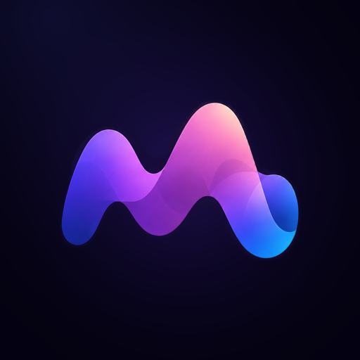
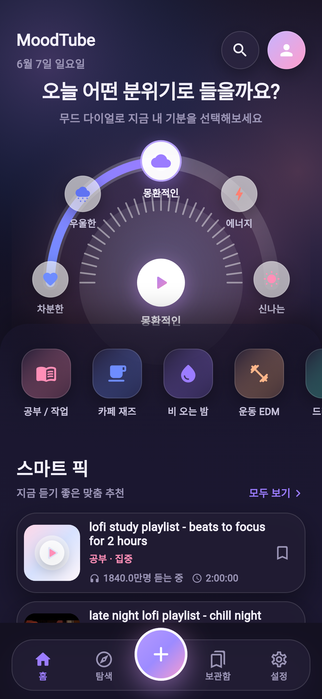
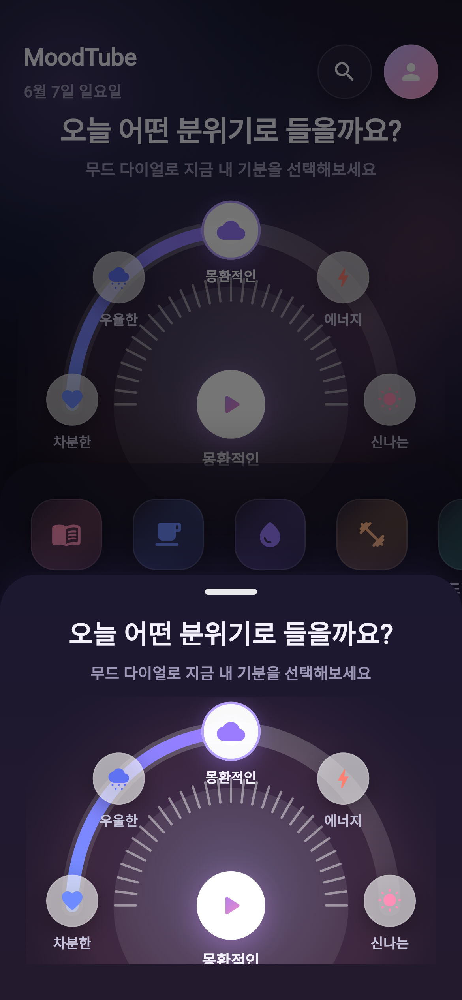
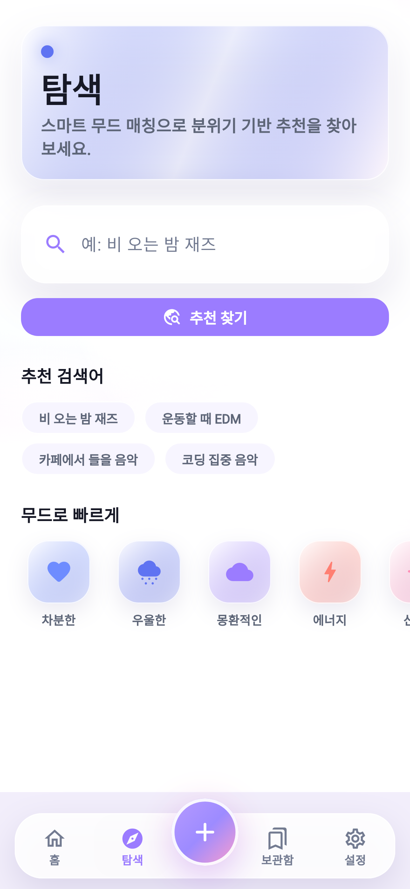
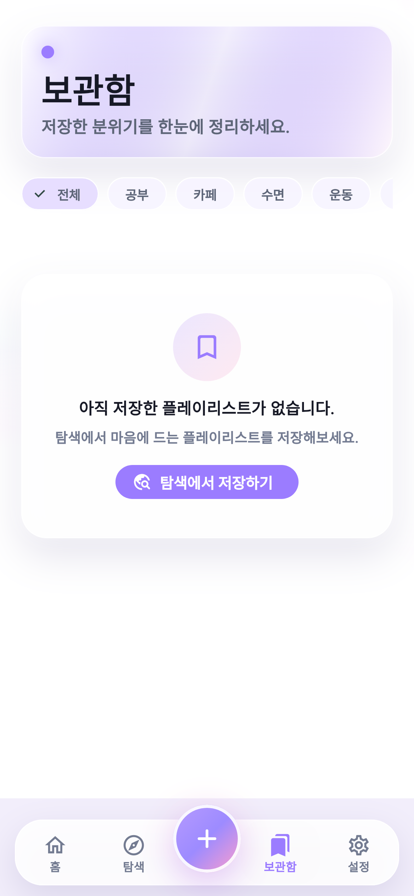

# MoodTube

[](LICENSE)
[](https://flutter.dev)

**기분에 맞는 YouTube 긴 플레이리스트를 찾아주는 Android 앱**

Find long YouTube music playlists that match your mood — focus, sleep, workout, late night, and more.

<p align="center">
  
</p>

## Screenshots

<p align="center">
  
  &nbsp;
  
  &nbsp;
  
  &nbsp;
  
</p>

More assets: [marketing/README.md](marketing/README.md)

## Features

- **Mood dial** — spin the spectrum dial to pick how you feel
- **Smart picks** — long playlists ranked by mood, views, and duration
- **Explore search** — free-text search with offline catalog fallback
- **Library** — bookmark favorites locally
- **3 languages** — English, Korean, Chinese (Simplified)
- **Light / dark theme** — follows system or manual override
- **Official YouTube embed** — no audio extraction, no downloads, no background play

## Quick start

Requires Flutter SDK `>=3.4.0`.

```bash
git clone https://github.com/atukunare/MoodTube.git
cd MoodTube
flutter pub get
flutter run
```

Works without an API key (uses the built-in `mockCatalog`).

### Release build

```bash
cp dart_defines.json.example dart_defines.json
# Add your restricted YouTube Data API key
cp android/key.properties.example android/key.properties
# Configure keystore

flutter build appbundle --release --dart-define-from-file=dart_defines.json
```

## Project structure

```text
lib/
  app.dart           App shell & theme
  state/             MoodTubeState (Provider)
  services/          YouTube search, scoring
  screens/           Home, Explore, Library, Player, Settings
  widgets/           Mood dial, navigation, cards
  data/              Offline mock catalog
  ads/               AdMob (mobile) / stub (web)
docs/                Privacy, AdMob guide, development reference
marketing/           Screenshots & store graphics
```

## Documentation

| Document | Description |
|----------|-------------|
| [CHANGELOG.md](CHANGELOG.md) | Release history |
| [CONTRIBUTING.md](CONTRIBUTING.md) | How to contribute |
| [docs/DEVELOPMENT.md](docs/DEVELOPMENT.md) | Architecture & design system |
| [docs/PRIVACY.md](docs/PRIVACY.md) | Privacy policy (en/ko/zh) |
| [docs/ADS_GUIDE.md](docs/ADS_GUIDE.md) | AdMob setup guide |
| [marketing/README.md](marketing/README.md) | Screenshot & asset index |

## Status

Google Play release **v0.3.4+6** (2026-07). AdMob + UMP consent. See [CHANGELOG.md](CHANGELOG.md) for details.

Privacy policy: [legitstudio.cc/moodtube/privacy](https://legitstudio.cc/moodtube/privacy)

## License

[MIT License](LICENSE) — Copyright (c) 2026 [atukunare](https://github.com/atukunare)

You are free to use, modify, and distribute this software. See [LICENSE](LICENSE) for the full text.
